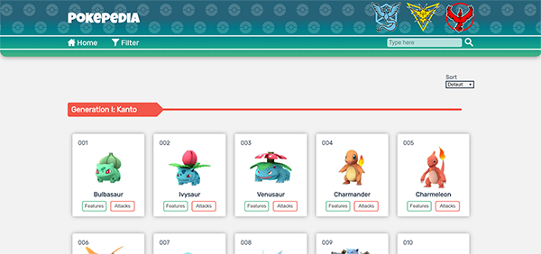
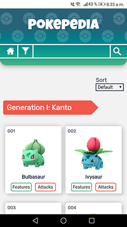
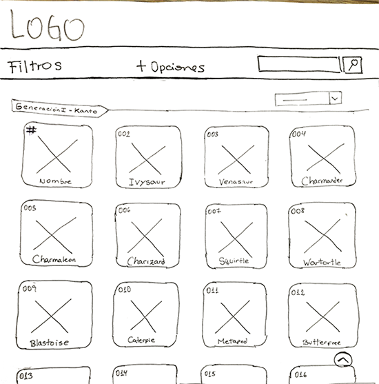
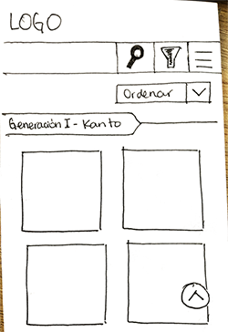
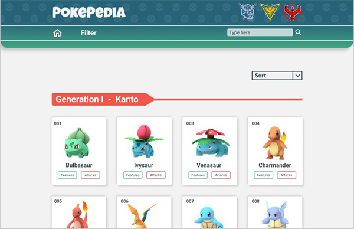
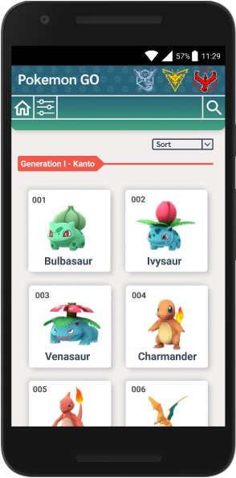

# TÍTULO: POKEPEDIA (Data Lovers)

##  RESUMEN:
* **POKEPEDIA** es el nexo entre **POKÉMON GO** y sus nuevos jugadores que quieren aprovechar al máximo dicho juego. Esto se logra gracias a que **POKEPEDIA** contiene información sobre los pokemones que pertenecen a las generaciones I y II, cuyas regiones son Kanto y Johto, respectivamente. Además, pueden acceder a datos estadísticos que les permitirán ser un gran **'Maestro Pokémon'**.

### IMAGEN FINAL DEL PROYECTO:

* Para Web

* Para Mobile

#### INVESTIGACIÓN UX:
 1. USUARIOS Y OBJETIVOS CON RELACIÓN AL PRODUCTO
    * Tras la lectura de la investigación acerca de los usuarios de **Pokémon GO** se buscó perfiles entre los que juegan Pokémon Go y aquellos que por primera vez iba a crearse una cuenta en dicho juego. De esta búsqueda se obtuvo que el rango de edad del ususario estaba entre los 20 a 35 años. Y también, se concluyó que al menos uno había visto como mínimo hasta 30 capítulos de **Pokémon** en su infancia y/o adolescencia. Además se identificó que los usuarios sentían la necesidad de tener una página donde puedan acceder a información de cada pokemon, ya sea desde qué tipo es, hasta la cantidad de daño que puede causar un ataque especial.
  2. ¿CÓMO **POKEPEDIA** SOLUCIONA LOS PROBLEMAS/NECESIDADES DE DICHOS USUARIOS?
    * **POKEPEDIA** es una página web que desde su bienvenida ya muestra la totalidad de pokemones que existen en las dos primeras regiones (Kanto y Johto), enumerados en orden ascendente. De esta forma permite al usuario identificar qué pokemones aún no han capturado. Además, al ser tantos pokemones, conforme explore más pokemones haciendo scroll, siempre visualizará el botón ascender para ser más amena su navegación por su interfaz. También identificará las opciones de "Search", para que ingresar directamente el nombre del pokémon para evitar el scroll; "Sort", para que pueda ordenarlos alfabeticamente o viceversa cuando no recuerda todo el nombre pero sí con qué letra inicia y el "Filter by type", para que acceda solo a aquellos pokémones de un mismo tipo. Y para finalizar, en cada card pokémon podrá encontrar las opciones "Features", para acceder a las características del pokémon elegido, y "attack", donde accederá a los datos stadísticos de cada pokémon para que su desenvolvimiento durante las batallas en los gimnasios tengan un mayor plan estratégico.

  3. PROTOTIPOS DE BAJA FIDELIDAD

  

  

  4. PROTOTIPOS DE ALTA FIDELIDAD

  
      
  

  5. HISTORIAS DE USUARIO 
  En el siguiente link => https://trello.com/b/tHgaOp0X/data-lovers podrán encontrar el número de historias en total que se plantearon, sus cambios y los pasos que se ejecutaron para que **POKEPEDIA** sea una realidad.
## 3. Objetivos de aprendizaje

El objetivo principal de este proyecto es que, entendiendo las necesidades de
tus usuarios, aprendas a diseñar y construir una interfaz web donde se pueda
visualizar y manipular data.

Revisa la lista y reflexiona sobre los objetivos que conseguiste en el
proyecto anterior. Piensa en eso al decidir tu estrategia de trabajo individual
y de equipo.

### UX

- [x] Diseñar la aplicación pensando y entendiendo al usuario.
- [x] Crear prototipos para obtener _feedback_ e iterar.
- [x] Aplicar los principios de diseño visual (contraste, alineación, jerarquía).
- [x] Planear y ejecutar _tests_ de usabilidad.

### HTML y CSS

- [x] Entender y reconocer por qué es importante el HTML semántico.
- [x] Identificar y entender tipos de selectores en CSS.
- [x] Entender como funciona `flexbox` en CSS.
- [ ] Construir tu aplicación respetando el diseño planeado (maquetación).

### DOM

- [x] Entender y reconocer los selectores del DOM (`querySelector` | `querySelectorAll`).
- [x] Manejar eventos del DOM. (`addEventListener`)
- [x] Manipular dinámicamente el DOM. (`createElement`, `appendchild`, `innerHTML`, `value`)

### Javascript

- [x] Manipular arrays (`filter` | `map` | `sort` | `reduce`).
- [x] Manipular objects (key | value).
- [x] Entender el uso de condicionales (`if-else` | `switch`).
- [x] Entender el uso de bucles (`for` | `forEach`).
- [ ] Entender la diferencia entre expression y statements.
- [x] Utilizar funciones (`parámetros` | `argumentos` | `valor de retorno`).
- [x] Entender la diferencia entre tipos de datos atómicos y estructurados.
- [x] Utilizar ES Modules (`import` | `export`).

### Pruebas Unitarias (_testing_)
- [x] Testear funciones (funciones puras).

### Git y GitHub
- [x] Ejecutar comandos de git (`add` | `commit` | `pull` | `status` | `push`).
- [x] Utilizar los repositorios de GitHub (`clone` | `fork` | `gh-pages`).
- [x] Colaborar en Github (`pull requests`).

### Buenas prácticas de desarrollo
- [x] Organizar y dividir el código en módulos (Modularización).
- [x] Utilizar identificadores descriptivos (Nomenclatura | Semántica).
- [x] Utilizar linter para seguir buenas prácticas (ESLINT).

## 9. Checklist

* [x] Usa VanillaJS.
* [x] No hace uso de `this`.
* [x] Pasa linter (`npm run pretest`)
* [x] Pasa tests (`npm test`)
* [x] Pruebas unitarias cubren un mínimo del 70% de statements, functions y
  lines y branches.
* [x] Incluye _Definición del producto_ clara e informativa en `README.md`.
* [x] Incluye historias de usuario en `README.md`.
* [x] Incluye _sketch_ de la solución (prototipo de baja fidelidad) en
  `README.md`.
* [x] Incluye _Diseño de la Interfaz de Usuario_ (prototipo de alta fidelidad)
  en `README.md`.
* [ ] Incluye link a Zeplin en `README.md`.
* [ ] Incluye el listado de problemas que detectaste a través de tests de
  usabilidad en el `README.md`.
* [ ] UI: Muestra lista y/o tabla con datos y/o indicadores.
* [x] UI: Permite ordenar data por uno o más campos (asc y desc).
* [x] UI: Permite filtrar data en base a una condición.
* [x] UI: Es _responsive_.
